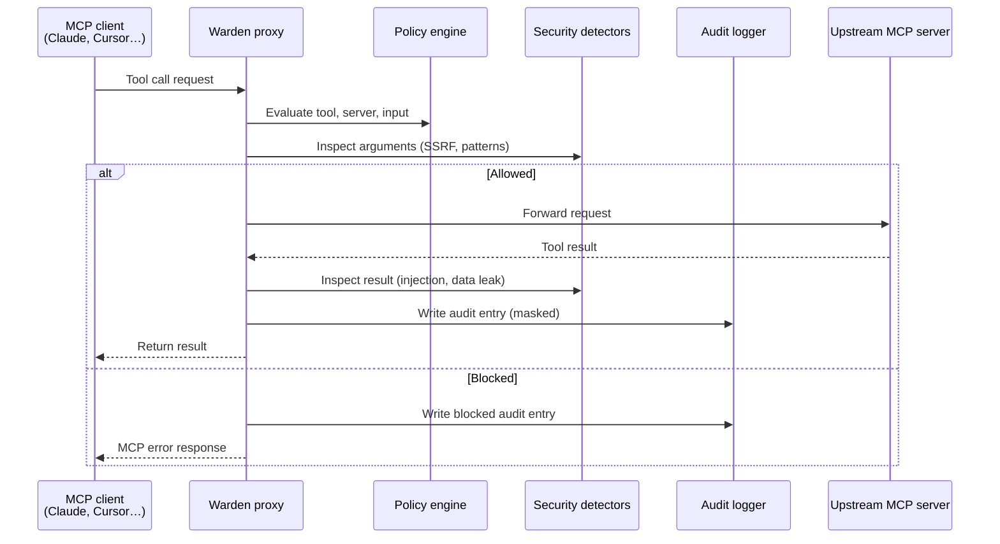

# Architecture

Warden CLI is a TypeScript CLI and local service layer that proxies MCP servers through a policy, audit, and security pipeline.

## High-Level Flow



## Components

| Area | Files | Responsibility |
|---|---|---|
| **CLI** | `src/cli/` | Commander-based commands and entrypoint wiring |
| **Proxy** | `src/proxy/` | MCP client/server bridge, stdio + HTTP transports, request handlers, notification relay |
| **Policy** | `src/policy/` | YAML schema, loader, rule evaluation, rate limiting, Git sync, SSH signature verification |
| **Security** | `src/security/` | SSRF guard, prompt-injection detector, data-leak heuristics |
| **Audit** | `src/audit/` | SQLite database, audit writes, query helpers, input masking |
| **Dashboard** | `src/dashboard/` | Local Express API, static dashboard app, WebSocket broadcast |
| **Daemon** | `src/daemon/` | Desktop notification delivery |
| **Utils** | `src/utils/` | Config path resolution, structured logging, shared error types |

## Proxy Startup Sequence

`McpProxy.start()` performs the core startup sequence:

1. Open the local SQLite database.
2. Create the audit logger.
3. Load policy from the configured file, or fall back to the default policy.
4. Connect to the upstream MCP server via stdio or HTTP.
5. Transform upstream capabilities for the client-facing server.
6. Wire the notification relay.
7. Register request handlers.
8. Connect the local MCP server to stdio.
9. Optionally watch the policy file for hot reload.

## Request Handling Pipeline

`RequestHandler` owns the boundary between the client-facing server and the upstream MCP client. Every tool call follows this order:

```
Incoming call
     │
     ▼
1. Policy evaluation     ← allow list, block list, custom rules, rate limit
     │
     ▼
2. SSRF guard            ← check URL-like argument values
     │
     ▼
3. Forward to upstream   ← stdio or HTTP MCP transport
     │
     ▼
4. Output inspection     ← injection patterns, data-leak heuristics
     │
     ▼
5. Notify                ← desktop notification on important events
     │
     ▼
6. Audit write           ← masked inputs, allow/block decision, result metadata
     │
     ▼
7. Return to client      ← upstream result, or MCP-shaped error if blocked
```

## Data Storage

All data is stored locally under `~/.warden/`:

| Path | Purpose |
|---|---|
| `~/.warden/config.yaml` | Local Warden configuration |
| `~/.warden/policy.yaml` | Default policy file |
| `~/.warden/warden.db` | SQLite audit log database |
| `~/.warden/logs/` | Structured log files |
| `~/.warden/allowed_signers` | Trusted SSH public keys for policy repo verification |

## Dashboard

The dashboard is an Express server exposing REST endpoints and a WebSocket channel.

- **REST** — status, logs, stats, policy CRUD, config CRUD.
- **WebSocket** — pushes recent log entries and status events to connected clients in real time.

The dashboard reads from `warden.db` directly. It does not require a hosted backend or external network service.

> The dashboard binds to localhost only and rejects non-local requests with `403`. Do not expose it publicly without adding authentication and transport security.

## Policy Sync

`PolicySync` manages pulling policy files from a remote Git repository:

- Uses `git clone` / `git pull` (fast-forward only) to sync to a local cache directory.
- Verifies SSH-signed commits via `git verify-commit` before applying any policy.
- `TrustedSigners` manages the `allowed_signers` file used for verification.
- Fast-forward-only pulls prevent history rewrite attacks.
- Use `--no-verify` to skip signature checks (not recommended outside development).

## Failure Philosophy

**Audit failures are non-fatal.** A failed log write should not crash a user's workflow.

**Policy and detector failures are treated carefully.** These affect allow/block decisions.

For security-sensitive code paths:

- **Fail closed** when policy enforcement cannot be trusted.
- **Fail open only** when explicitly documented as best-effort behavior.
- **Log and notify** when the information is useful for investigation.

This means a broken policy load causes a fallback to a safe default, not a silent pass-through.
