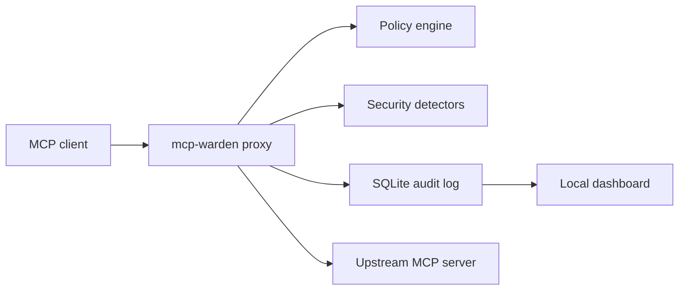

<div align="center">

# MCP Warden

Local-first security gateway for MCP servers.

[](../../actions/workflows/ci.yml)


</div>

MCP Warden sits between an MCP client and one or more MCP servers. It proxies tool calls, evaluates policy, records audit logs, masks sensitive fields, and detects common security risks before tool output reaches the rest of your workflow.

It is designed for local development and personal MCP setups where you want visibility and guardrails without sending logs to a hosted service.

## Contents

- [Features](#features)
- [How It Works](#how-it-works)
- [Installation](#installation)
- [Quick Start](#quick-start)
- [CLI Reference](#cli-reference)
- [Policy Files](#policy-files)
- [Dashboard](#dashboard)
- [Documentation](#documentation)
- [Project Structure](#project-structure)
- [Development](#development)
- [Testing](#testing)
- [Security Notes](#security-notes)
- [Contributing](#contributing)
- [License](#license)

## Features

- Proxy MCP servers through a local gateway.
- Wrap existing Claude Desktop, Cursor, and `.mcp.json` server configs.
- Evaluate allow lists, block lists, rate limits, and custom policy rules.
- Store audit logs in a local SQLite database.
- Redact sensitive input fields before storage.
- Detect SSRF-like URLs in tool arguments.
- Warn on prompt-injection-like responses.
- Block or warn on large, high-entropy, repetitive, or PII-heavy responses.
- Scan MCP servers before connecting to estimate exposed tool risk.
- Serve a local dashboard with audit log, policy, config, and analytics APIs.
- Sync policy files from a Git repository.

## How It Works



The proxy keeps the MCP protocol boundary intact:

1. The MCP client talks to `mcp-warden`.
2. Warden connects to the target MCP server.
3. Tool calls are checked against policy and security detectors.
4. Allowed calls are forwarded upstream.
5. Results and decisions are logged locally.

## Installation

### From npm

Install globally:

```bash
npm install -g mcp-warden
mcp-warden --help
```

Run without installing:

```bash
npx mcp-warden --help
```

### From Homebrew

Install from the GitHub release formula:

```bash
brew install --formula https://github.com/flyingsquirrel0419/mcp-warden/releases/latest/download/mcp-warden.rb
```

### With curl

Install the latest GitHub release through npm:

```bash
curl -fsSL https://github.com/flyingsquirrel0419/mcp-warden/releases/latest/download/install.sh | sh
```

Install a specific version:

```bash
MCP_WARDEN_VERSION=1.0.0 sh -c "$(curl -fsSL https://github.com/flyingsquirrel0419/mcp-warden/releases/latest/download/install.sh)"
```

### From source

```bash
git clone https://github.com/flyingsquirrel0419/mcp-warden.git
cd mcp-warden
npm ci
npm run build
```

For local CLI testing:

```bash
npm link
mcp-warden --help
```

### Requirements

- Node.js `>=20.0.0`
- npm
- An MCP server command to proxy or scan

## Quick Start

Start by scanning an MCP server:

```bash
mcp-warden scan --target "npx @some/mcp-server"
```

Proxy a server through Warden:

```bash
mcp-warden proxy \
  --target "npx @some/mcp-server" \
  --name my-server \
  --policy ~/.mcp-warden/policy.yaml
```

Discover MCP servers from known config locations:

```bash
mcp-warden discover
```

Wrap discovered servers automatically:

```bash
mcp-warden discover --wrap
```

Open the local dashboard:

```bash
mcp-warden dashboard --port 4242
```

## CLI Reference

| Command                               | Purpose                                                              |
| ------------------------------------- | -------------------------------------------------------------------- |
| `mcp-warden proxy --target <command>` | Start proxying an MCP server through Warden.                         |
| `mcp-warden scan --target <command>`  | Inspect a target server's tools and estimate risk.                   |
| `mcp-warden discover`                 | Find MCP servers in Claude Desktop, Cursor, and `.mcp.json` configs. |
| `mcp-warden discover --wrap`          | Rewrite discovered configs to run through Warden.                    |
| `mcp-warden init`                     | Wrap existing MCP client configurations.                             |
| `mcp-warden status`                   | Show recent audit log entries.                                       |
| `mcp-warden log`                      | Query audit logs with filters.                                       |
| `mcp-warden dashboard`                | Start the local web dashboard.                                       |
| `mcp-warden policy sync`              | Sync policy files from a Git repository.                             |
| `mcp-warden policy list`              | List synced policy files.                                            |
| `mcp-warden policy apply`             | Apply a synced policy file.                                          |

### Log filters

```bash
mcp-warden log --server my-server --tool search --limit 20
mcp-warden log --blocked
mcp-warden log --tail
```

### Policy sync

```bash
mcp-warden policy sync --repo https://github.com/example/mcp-policies.git --list
mcp-warden policy list --repo https://github.com/example/mcp-policies.git
mcp-warden policy apply --repo https://github.com/example/mcp-policies.git --policy strict.yaml
```

## Policy Files

Default location:

```text
~/.mcp-warden/policy.yaml
```

Example:

```yaml
version: 1

defaults:
  mode: audit-only
  alert_on_new_tool: true

servers:
  my-server:
    mode: enforcing
    allowed_tools:
      - search
      - read_file
    blocked_tools:
      - delete_file
      - run_shell
    rate_limit:
      per_minute: 60
      per_hour: 1000
    rules:
      - name: block-secrets
        description: Block tool calls that include secret-looking input.
        match:
          input:
            token:
              pattern: ".+"
        action: block
        message: Token input is not allowed.
```

### Policy modes

| Mode          | Behavior                                 |
| ------------- | ---------------------------------------- |
| `passthrough` | Allow calls without policy enforcement.  |
| `audit-only`  | Allow calls but record policy decisions. |
| `enforcing`   | Block calls that violate policy.         |

## Dashboard

The dashboard runs locally and reads from Warden's SQLite database.

```bash
mcp-warden dashboard
```

Default URL:

```text
http://localhost:4242
```

Dashboard APIs include:

- `GET /api/status`
- `GET /api/logs/recent`
- `GET /api/stats/server/:name`
- `GET /api/stats/tools`
- `GET /api/stats/analytics`
- `GET /api/policy`
- `PUT /api/policy`
- `GET /api/config`
- `PUT /api/config`

## Documentation

- [CLI guide](docs/CLI.md)
- [Policy guide](docs/POLICY.md)
- [Architecture](docs/ARCHITECTURE.md)
- [Operations guide](docs/OPERATIONS.md)
- [Release guide](docs/RELEASE.md)
- [Security model](docs/SECURITY_MODEL.md)
- [Security policy](SECURITY.md)
- [Contributing](CONTRIBUTING.md)
- [Code of conduct](CODE_OF_CONDUCT.md)
- [Support](SUPPORT.md)
- [Changelog](CHANGELOG.md)

## Project Structure

```text
src/
  audit/       SQLite audit log, masking, database setup
  cli/         Commander-based CLI commands
  daemon/      Notification delivery
  dashboard/   Local dashboard server and static assets
  policy/      Policy schema, loader, engine, sync, rate limiter
  proxy/       MCP proxy, transports, request handlers
  security/    SSRF, injection, and data leak detectors
  utils/       Config, logger, and shared errors
tests/
  audit/
  cli/
  daemon/
  dashboard/
  helpers/
  integration/
  policy/
  proxy/
  security/
  utils/
```

## Development

Install dependencies:

```bash
npm ci
```

Run the build:

```bash
npm run build
```

Run the development build watcher:

```bash
npm run dev
```

Format files:

```bash
npm run format
npm run format:check
```

## Testing

Run the full test suite:

```bash
npm test
```

Run type checking:

```bash
npm run lint
```

Run coverage:

```bash
npm run test:coverage
```

Run the same checks as CI:

```bash
npm run format:check
npm run lint
npm test
npm run build
npm audit
```

## Security Notes

MCP Warden is a local guardrail, not a full sandbox.

- Policy enforcement depends on the configured policy mode.
- Audit logs are stored locally under `~/.mcp-warden`.
- Sensitive keys are masked before storage, but avoid sending secrets to untrusted tools.
- SSRF and data-leak detectors are heuristic defenses.
- Review scanned tools before wrapping unknown MCP servers.

## Contributing

Contributions are welcome. Keep changes focused, include tests for behavior changes, and run the CI checks locally before opening a pull request.

Recommended workflow:

1. Create a topic branch.
2. Make the smallest useful change.
3. Add or update tests.
4. Run `npm run format:check`, `npm run lint`, `npm test`, `npm run build`, and `npm audit`.
5. Open a pull request with a short summary and verification notes.

## License

Apache-2.0
