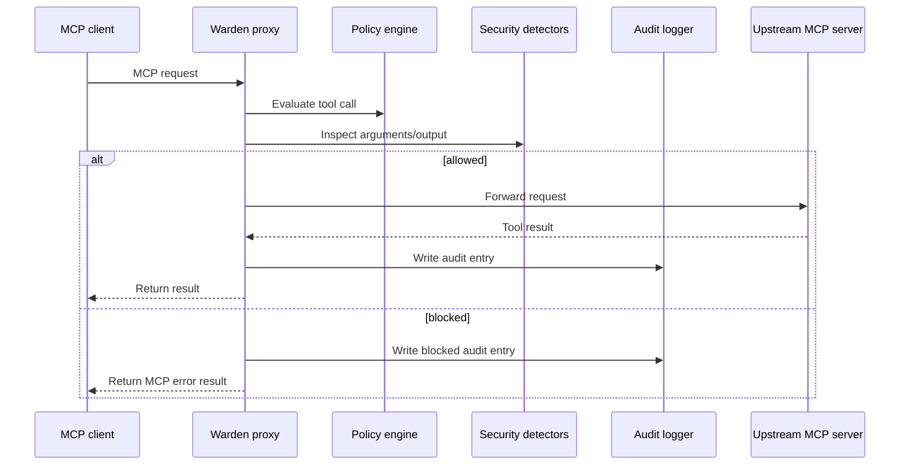

# Architecture

MCP Warden is a TypeScript CLI and local service layer for proxying MCP servers through policy, audit, and security checks.

## High-Level Flow



## Main Components

| Area      | Files            | Responsibility                                                            |
| --------- | ---------------- | ------------------------------------------------------------------------- |
| CLI       | `src/cli/`       | Commander-based commands and entrypoint wiring.                           |
| Proxy     | `src/proxy/`     | MCP client/server bridge, transports, request handlers, notifications.    |
| Policy    | `src/policy/`    | Policy schema, YAML loading, rule evaluation, rate limiting, policy sync. |
| Security  | `src/security/`  | SSRF, injection, and data leak heuristics.                                |
| Audit     | `src/audit/`     | SQLite database, audit writes, query helpers, input masking.              |
| Dashboard | `src/dashboard/` | Local Express API, static dashboard, WebSocket updates.                   |
| Daemon    | `src/daemon/`    | Notification delivery.                                                    |
| Utils     | `src/utils/`     | Config paths, logging, shared error types.                                |

## Proxy Startup

`McpProxy.start()` performs the core startup sequence:

1. Open the local SQLite database.
2. Create the audit logger.
3. Load policy from a configured file or fall back to the default policy.
4. Connect to an upstream MCP server through stdio or HTTP.
5. Transform upstream capabilities for the client-facing server.
6. Wire notification relay.
7. Register request handlers.
8. Connect the local MCP server to stdio.
9. Optionally watch the policy file for hot reload.

## Request Handling

`RequestHandler` owns the request boundary between the client-facing MCP server and the upstream MCP client.

Tool calls are processed in this order:

1. Evaluate policy for server, tool, and input.
2. Check arguments for SSRF risk when configured.
3. Forward allowed calls to the upstream server.
4. Inspect the response for injection or data leak patterns when configured.
5. Notify on important events.
6. Write an audit record.
7. Return either the upstream result or an MCP error-shaped response.

## Data Storage

Warden stores data locally under:

```text
~/.mcp-warden/
```

Important paths:

| Path                        | Purpose                     |
| --------------------------- | --------------------------- |
| `~/.mcp-warden/config.yaml` | Local Warden configuration. |
| `~/.mcp-warden/policy.yaml` | Default policy file.        |
| `~/.mcp-warden/warden.db`   | SQLite audit log database.  |
| `~/.mcp-warden/logs/`       | Log directory.              |

## Dashboard

The dashboard is an Express server with REST endpoints for status, logs, stats, policy, and config. It also exposes a WebSocket server that sends recent log entries to connected clients and broadcasts status events.

The dashboard should remain local by default. Do not expose it publicly without an authentication and network isolation plan.

## Failure Philosophy

Audit logging failures are intentionally non-fatal: the proxy should not crash a user workflow because a log write failed. Policy and detector failures should be treated more carefully because they affect allow/block decisions.

For security-sensitive changes, prefer explicit behavior:

- fail closed when policy enforcement cannot be trusted;
- fail open only when the code path is explicitly documented as best-effort;
- log or notify when useful for investigation.
